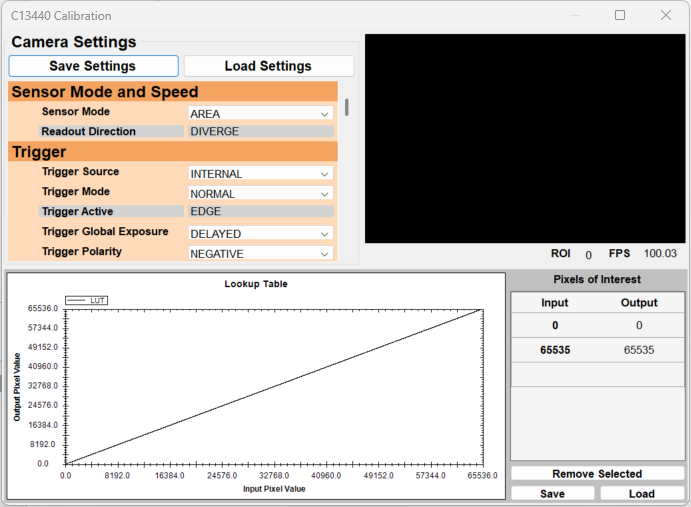
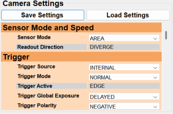
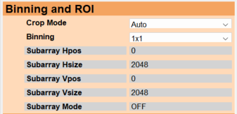
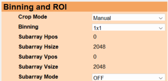
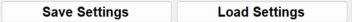
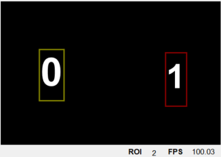
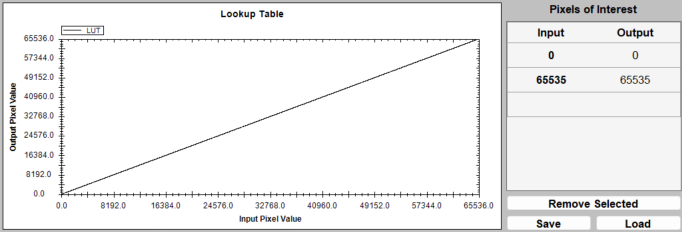
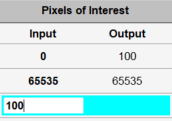
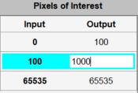

# C13440 Editor

Double clicking the C13440 node while the workflow is stopped opens up the C13440 Calibration window.

## Camera Settings

A table of all of the settings for the C13440 camera grouped by type. 

A gray background indicates that the setting is readonly and this is typically static. However, a key exception here is in the `Binning and ROI` group, where the `Subarray *` settings are readonly when `Crop Mode` is `Auto` and configurable when `Crop Mode` is `Manual`.

In addition to the table of all settings are `Save Settings` and `Load Settings` buttons. These buttons save and load an .xml file that contains all of the camera settings and ROIs. 

## ROI Editor

Displays a live image from the camera with the ROIs overlayed. Also displays the ROI count and current frame rate in the bottom right corner.

- Drawing a new ROI: Left Click + Drag in an unoccupied area.
- Select an existing ROI: Left Click on an existing ROI or press Tab to select the next ROI.
- Move an existing ROI: Left Click + Drag on an existing ROI
- Resize an existing ROI: Right Click + Drag on an existing ROI
- Force Square: Use the CTRL modifier while drawing or resizing an ROI. 
- Delete an existing ROI: Press DEL to delete the currently selected ROI

Note: Setting the `Crop Mode` setting to `Auto` will cause the `Subarray *` settings to automatically be specified to the minimal bounding rectangle encompassing all of the existing ROIs

## LUT Editor

Consists of a graph of the LUT as well as a `Pixels of Interest` table for configuring the LUT. The LUT is defined in 16-bit values, however, when the pixel type of the image is configured to be 8-bit the LUT used will automatically be converted to 8-bit. 

Note: Although the LUT can be used to change the output pixel values to better fit the dynamic range, it cannot currently be used to convert the bit-depth of the image container used to contain the image data. For example, if the camera's pixel type is Mono8, the LUT cannot be used to convert the images to Mono16. 

### Pixels of Interest

The LUT is generated by interpolating between the defined `Pixels of Interest`. The `Pixels of Interest` can be saved or loaded using the `Save` and `Load` buttons. The last row of the table is used to create new `Pixels of Interest`. To do so follow the steps below:

- Select the Input cell of the bottom row and specify the input value.

- Select the Output cell of the new row and specify the output value.

The Output value of all existing `Pixels of Interest` can be edited by clicking the output cell, specify the new value, and clicking away. 

A pixel of interest can be remove by selecting a row and clicking the `Remove Selected` button. 
