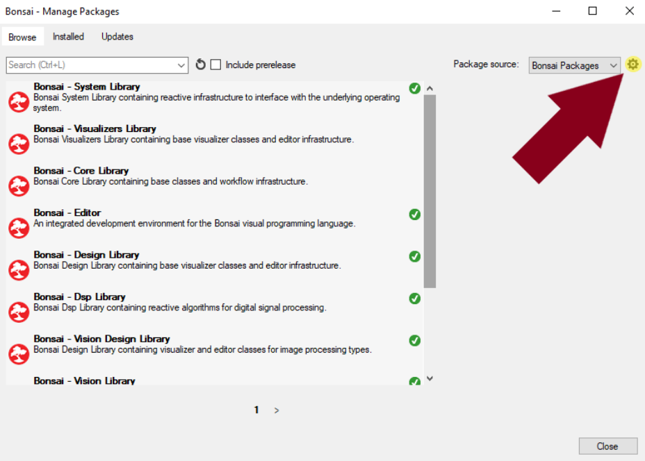
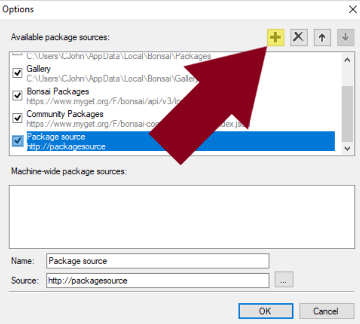
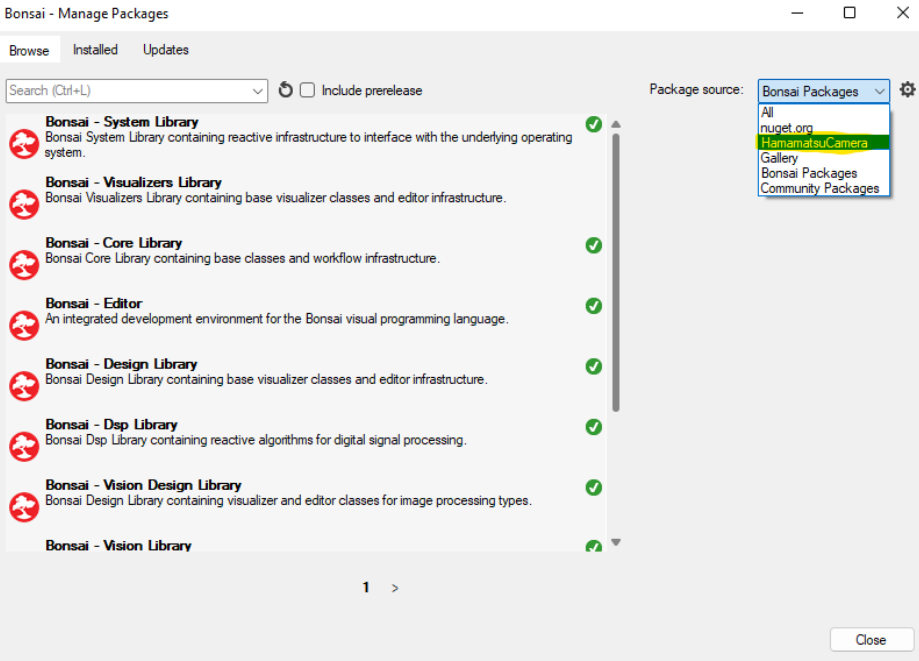
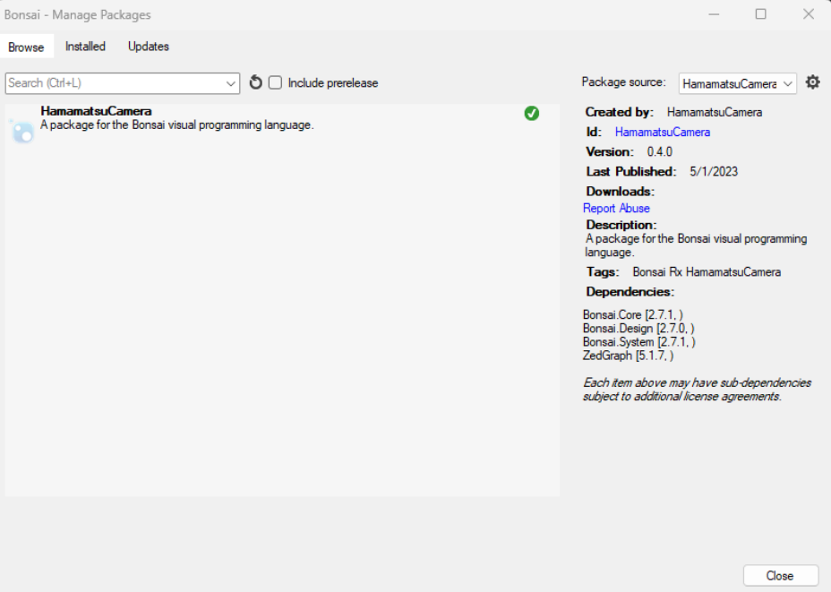

# Installation

Bonsai is configured to search for packages online using NuGet.org and MyGet.org as package sources. However, Bonsai also has the capability to create offline package sources for cases such as this, where the NuGet packages are not published online. Begin by opening the Bonsai application and navigating to the “Manage Packages” window. Find and click the cog wheel next to the “Package Source” dialog in the top right corner of the window.

Clicking the cog wheel will open an “Options” window for configuring Bonsai’s package sources. To create a new package source, click the “➕” button.

Configure the new package source by specifying the “Name” and the “Source” properties. The “Name” can be anything, but “Source” must be the folder that contains the NuGet packages of interest. In this case, specify the “Source” to be the location of the nuget packages. To do this, click the “…” button to the right of the “Source” text field, navigate to the “<NugetFolder>” folder, and click “Select Folder”.

Once the new package source is created and configured, click “OK” to return to the “Manage Packages” window. The new package source should now be present in the drop down menu next to the “Package Source” dialog.

When the new package source is selected as the “Package Source”, the “HamamatsuCamera” and “Hamamatsu” packages should appear as available to install. Install both packages, note that installing the “HamamatsuCamera” package first will automatically install the “Hamamatsu” package as well.

