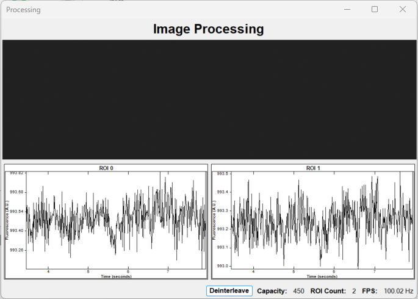
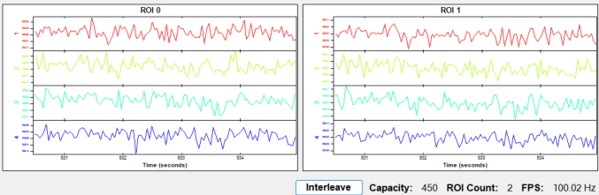
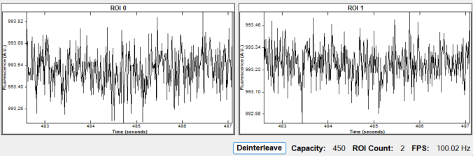

# Processing Visualizer

Double clicking the Processing node while the workflow is running opens up the Processing Visualizer. This visualizer displays the live image coming from the camera as well as a rolling graph for each defined ROI.

At the bottom of the window is a `Deinterleave`/`Interleave` button as well as values for the capacity of each graph, number of ROIs, and current frame rate.

Clicking `Deinterleave` will change the view of each graph so that raw data is split up into the number of channels specified by the `DeinterleaveCount` property of the `Processing` node.

Clicking `Interleave` will bring the graphs back to the default view where the raw data is plotted in a single graph.

